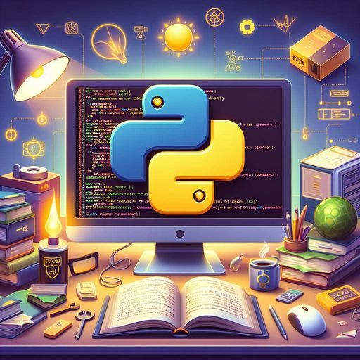

# Mini Proyectos Python:
 ### Proyectos diversos en Python.



# Índice

1. [Requisitos](#requisitos)
2. [Modo de uso](#modo-de-uso)
3. [Estructura del Proyecto](#estructura-del-proyecto)
4. [Imágenes](#imágenes)
5. [Archivos Principales](#archivos-principales)
6. [Notas](#notas)
7. [Contacto](#contacto)
8. [Tecnologías utilizadas](#tecnologías-utilizadas)

Este repositorio contiene una colección de proyectos cortos en Python. La idea es ir agregando nuevos proyectos con el tiempo, abarcando diferentes áreas y aplicaciones del lenguaje. Cada proyecto está organizado en su propia carpeta y contiene las instrucciones necesarias para su uso y despliegue.


## Requisitos

Asegúrate de tener Python 3.x instalado y las siguientes bibliotecas requeridas:

- Random


Puedes instalar las dependencias con el siguiente comando:

```
pip install Random 
```

## Modo de uso

### Cómo Inicializar en tu PC.

Para ejecutar esta aplicación en tu máquina local, sigue estos pasos:

1. Clona este repositorio en tu sistema local.
git clone <URL-del-repositorio>
    cd nombre-del-repositorio


2. **Instalar Dependencias:**

    Asegúrate de tener Python y pip instalados. Luego, instala las dependencias necesarias ejecutando:
pip install -r requirements.txt

3. **Ejecutar la Aplicación:**

    Una vez que todas las dependencias estén instaladas, puedes ejecutar la aplicación:

python main.py


## Estructura del Proyecto

El repositorio cuenta con carpetas, en las cuales se encuentran los proyectos de manera separada:

**1. Ahorcadito:**

-   El jugador debe adivinar una palabra oculta antes de quedarse sin vidas.
    
    El juego procede de la siguiente manera:
    1. Lee una lista de palabras desde un archivo.
    2. Muestra un mensaje de bienvenida y proporciona detalles del juego.
    3. Inicializa las variables del juego, incluyendo el número de vidas y la palabra a adivinar.
    4. Ejecuta un bucle principal donde el jugador ingresa letras para adivinar la palabra.
    5. Verifica si la letra ingresada está en la palabra y actualiza la visualización.
    6. Muestra el dibujo del ahorcado en caso de errores.
    7. Pregunta al usuario si desea jugar de nuevo después de ganar o perder.

    

**2. Piedra, Papel o Tijera:**

- Juega al juego de Piedra, Papel o Tijera contra la computadora.  
El juego continúa hasta que uno de los jugadores (usuario o computadora) alcance 3 puntos.
Después de cada partida, se pregunta al usuario si desea jugar nuevamente.


## Imagenes


## Archivos Principales

**- main.py:** 
  Archivo principal que contiene el código del proyecto, en cada carpeta.


**- imagen:**
   - python-AI.jpg : Utilizada en la preesentacion del repositorio.


## Notas

Asegúrate de mantener actualizados los archivos del proyecto para que la aplicación funcione correctamente.

## Contacto

### Blas Fernando Pacios

[   
](https://www.linkedin.com/in/blas-fernando-pacios) 
[
](https://wa.me/5493815467488)

## Tecnologías utilizadas


